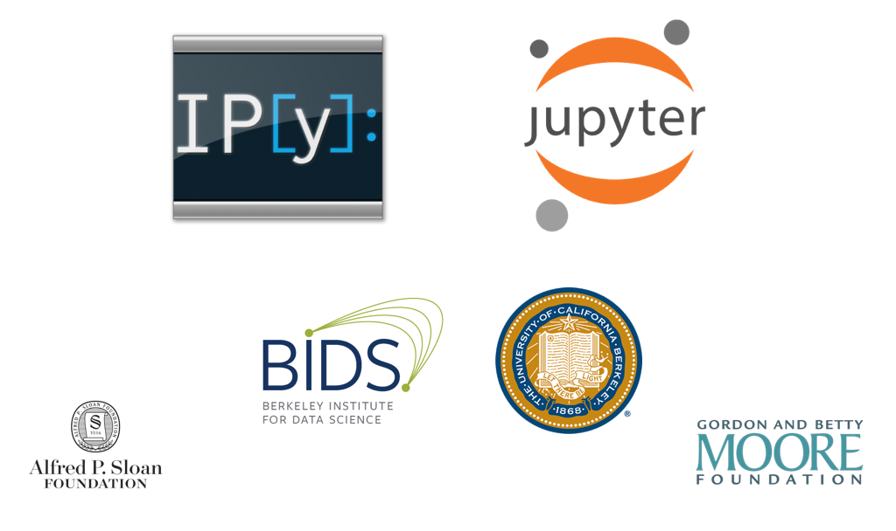
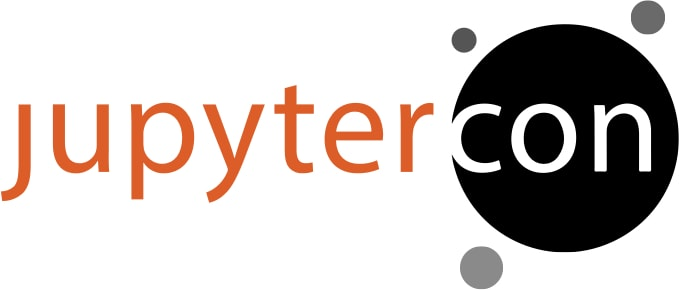
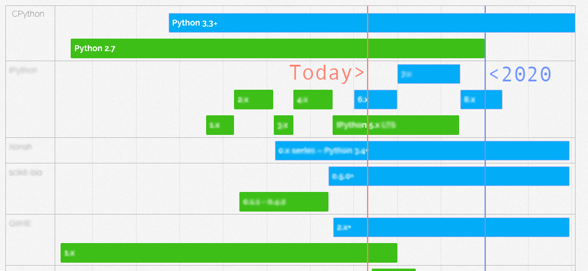
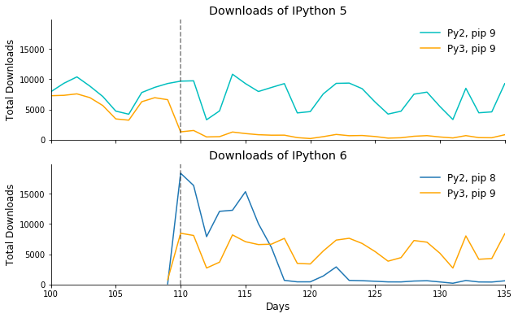

<!-- .slide: data-background="./cityscape.png" -->

# Building Bridges, not walls

## Ending Python2 compatibility in a user friendly manner

M Bussonnier & M Pacer

Slides available at http://bit.ly/pycon2017-build-bridges

----

# About us

We have been working on the IPython and Jupyter projects for 
5 and ~1 year. 

github:@Carreau/twitter:@Mbussonn

github:@mpacer/twitter:@mdpacer

--



-- 


jupytercon.com – August 22-25; NYC

----


## What this talk is **not** about

- Is Python 2 or 3 the right choice? 
- Should I migrate to Python3-only?

--

## What this talk **is** about

We migrated IPython to Python 3 only. 

We care about *all* of our users, Python 2 and 3 alike.

We want to make the transition the least frustrating for users and dev.

We'll be describing how we did this.

--

## Python 2 vs 3 is an **example**

The lessons we've learned are not specific a python2 to python3 transition. 

Our talk applies to stopping support for any version (e.g., 2.6 or 3.3).

----

# Python 3 Statement

[www.python3statement.org](http://www.python3statement.org/)

List of who is stopping Python 2 support when. 
Resources on how to stop support with minimal frustration for users

--


Note: We should have text notes here to simplify reading this off.

--



Timeline of Python 2 End of Life for various projects.

Note: We should have text notes here to simplify reading this off.

----

# Scratch your own itch

We wanted to release IPython 6, the code base should be Python 3 only.

We care about Python 2 users, so if a Python 2 user runs

    $ pip install ipython --upgrade

it should install the latest version of IPython 5, not IPython 6!

--

## Core of the problem

```bash
$ pip install ipython --upgrade
Installing ipython... doing magic... success

$ python
>>> import IPython
SyntaxWarningErrorError("I Just don't like you.")
```

----

#  Solutions (Not really)

Let's go back to 2016.

-- 

Just use `$ pip install "ipython<6"` on Python 2

--

- Users do not always read documentation before installing.
- Scripts do not read documentation before installing. 
- Users/scripts do not read error messages.
- dependencies – all packages need update to have conditional dependencies.

--

## Rename ?

That's going to be confusing and void most of the documentation on the
Internet.

Import names different from package name is also a bit tricky to explain
sometime.

--

## Wheel only ?

Ok-ish for Pure-Python packages.

Many downstream distribution requires sdist.

--

## Use a metapackage

Use a package with virtually no-code that have conditional dependencies, and move the  "real" code to a sub package.

 - You kinda need to re-release old code (can't requires old-yourself)
 - `pip upgrade metapackage` will not pull `core` unless pinned deps


--

## use a pip ~~bug~~ "Hidden Feature":

```python
# somewhere in pip
_py_version_re = re.compile(r'-py([123]\.?[0-9]?)$')

# somewhere else
if is_tar_gz(file):
    match = self._py_version_re.search(version)
    if match:
        version = version[:match.start()]
        py_version = match.group(1)
        if py_version != sys.version[:3]:
            self._log_skipped_link(
                link, 'Python version is incorrect')
            return
```

-- 

## use a pip ~~bug~~ "Hidden Feature":

You can publish `ipython-py3.3.tar.gz` and `ipython-py3.4.tar.gz` and
`ipython-py3.5.tar.gz` and `ipython-py3.6.tar.gz` and `ipython-py3.7.tar.gz` to
be future proof.

But it does not work beyond Python 3.9... 

--

As Raymond Hettinger would say if he is in the room


> There must be a better way !

----

# The new way: Python-Requires
<!--# (re)-Introducting `python_requires`-->

Since December with pip 9.0.1, and setuptools 24.3:

```python
# setup.py

setup(..., 
    python_requires='>=3.4'
)
```

Use `pip install` and it will adhere to `python_requires`. 

**N.B.**: Do not invoke `setup.py` directly!

-- 

## In greater detail

--

`python_requires` metadata comes from [pep 345](https://www.python.org/dev/peps/pep-0345/#requires-python), 2005.

But for 11 years nothing implemented or understood it. 

-- 

### setuptools >= 24.3 

The `python_requires` keyword in known only by setuptools versions > 24.3.

- Required to **build** the sdist/wheel and publish the package
- Required to **install** from sdist. 

-- 

### pip >= 9.0.1

From PyPI:
Versions of pip < 9 ignore `data-requires-python` attributes. 

This will result in installing incompatible versions.

---- 

# Under the Hood

-- 

## The old PEP

[PEP 345](https://www.python.org/dev/peps/pep-0345/#requires-python)

    Requires-Python
    ===============

    This field specifies the Python version(s) that the
    distribution is guaranteed to be compatible with.

    Version numbers must be in the format specified in
    Version Specifiers.

    Examples:

        Requires-Python: 2.5
        Requires-Python: >2.1

-- 

Great! Now what? How do we use it?

-- 

## Patch all the things!


--

## Build: Setuptools

As of [setuptools 24.2](https://github.com/pypa/setuptools/pull/631/): 

```python
# setup.py

setup(..., 
    python_requires='>=3.4'
)
```

Note: @xavfernandez for making that possible.

-- 

## Upload: PyPI & Warehouse

Updates the `release_files` table backing PyPI-legacy and Warehouse

-- 

## Surface: PyPI

[PEP 503](https://www.python.org/dev/peps/pep-0503/) defines `/simple/`
repositories formats. 

Require Python info is surfaced in the `data-requires-python` attribute

-- 

### view-source:https://pypi.python.org/simple/pip/

```html
<!DOCTYPE html><html><head><title>Links for pip</title></head><body><h1>Links for pip</h1>
<a href="…/pip-8.0.0-py2.py3-none-any.whl" >pip-8.0.0-py2.py3-none-any.whl</a><br/>
<a href="…/pip-6.0.4.tar.gz" >pip-6.0.4.tar.gz</a><br/>
<a href="…/pip-0.3.1.tar.gz" >pip-0.3.1.tar.gz</a><br/>
<a href="…/pip-1.0.1.tar.gz" >pip-1.0.1.tar.gz</a><br/>
<a data-requires-python=">=2.6,!=3.0.*" href="…/pip-9.0.1.tar.gz" >pip-9.0.1.tar.gz</a><br/>
```

--

## Install : Pip

Pip 9+ checks `data-requires-python` before downloading 

-- 

**N.B.**: If you are running (or maintain) a PyPI proxy please make sure it surfaces 
new `data-requires-python`. PEP 503 

--


<!--## The pull requests on The GitHub.-->

<!--- https://github.com/pypa/warehouse/pull/1513-->
<!--- https://github.com/pypa/warehouse/pull/1448-->
<!--- https://github.com/pypa/warehouse/pull/1448-->
<!--- https://github.com/pypa/warehouse/pull/1268-->
<!--- https://github.com/pypa/pypi-legacy/pull/524-->
<!--- https://github.com/pypa/pypi-legacy/pull/506-->
<!--- https://github.com/pypa/pip/pull/3877-->


<!--Thanks PyPA team !-->

--

## Tying it together 

Setuptools, PyPI, Wareshouse and pip are updated and deployed!

--

## Call to packaging tool maintainers

* many have already been updated 
    * flit, twine
* be among there number (so I can give you free advertising) 

--

## Call to all package maintainers

* Use tools and services that respect Require-Python

### Most of all: 

* Tell your users to update pip!

---- 

# Defensive packaging

Even if you adhere to that, problems will arise.

Some helpful principles to keep your users as happy as possible

--

1. Update your documentation and scripts to use `pip`.

2. Keep `setup.py` and `__init__.py` python 2 compatible,  
   but have them err early. 

   <!-- .element: class="fragment" data-fragment-index="1" -->

3. For clear error messages in complicated situations,   
   use multiple lines.

   <!-- .element: class="fragment" data-fragment-index="2" -->

--

## Tell everyone to `pip install`

Update your documentation and scripts to use `pip install [-e] .`. 

Reiteration: Do not use `python setup.py <…>`;  
it ignores `requires_python`.

-- 

### PEP 518 was merged!

PEP 518 implementation was merged yesterday `pyproject.toml`

-- 

## Keep `setup.py` python 2 compatible. 

If your `setup.py` most probable reason: 

**pip < 9**. 

Don't just say your package is incompatible with `python2`.

Instead: Ask users to update pip.

--

E.g.,: in `setup.py`:

```python
if sys.version_info < (3, 3):
    error = """
IPython 6.0+ does not support Python 2.6, 2.7, 3.0,
3.1, or 3.2. Beginning with IPython 6.0, Python 3.3
and above is required.

This may be due to an out of date pip.

Make sure you have pip >= 9.0.1.
"""
    sys.exit(error)
```
-- 

## Keep `__init__.py` python 2 compatible

Users will still find ways to avoid `pip` and `setup.py`.  
E.g.:

```bash
$ pip install -e . 
$ ...
$ git pull  # update without install
```

--

E.g., in `__init__.py`: 

```python
import sys
if sys.version_info < (3,3):
    raise ImportError(
"""
IPython 6.0+ does not support Python 2.6, 2.7, 3.0,
3.1, or 3.2. Beginning with IPython 6.0, Python 3.3
and above is required.
""")
```

----

# Results



-- 

## Bug reports / complaints

Two. 

- During RC: `python setup.py install` got 6.0 on Python 2 – now documented.

- "My Bad I did not read the error message"

---- 

# Conclusions

-- 
 
## On IPython 

- IPython 6+ is Python3 only
- We're still updating the IPython 5.x – Python 2 LTS branch
- Transition has gone relatively well for IPython! 
   - It will only get easier!

--

## On converting packages to Python3 only 

- use packaging tools that respect `Requires_Python`
- encourage everyone, everywhere to use pip 9+
- follow defensive packaging practices 
- Read and contribute to python3statement practicalities section

----

# Thanks!

Python 2 \u2661 Python 3

(that's a ♡ ) <!-- .element: class="fragment" data-fragment-index="1" -->


